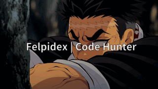

  

<

  

<i>"Respiração da Programação, Primeira Forma: Hello World!"</i>

---

## 💫 Sobre mim
- 👨‍💻 Estudante de **Ciência da Computação**  
- 🎮 Apaixonado por **Games, Animes**  e **Impressão 3D**
- 🛠️ Atualmente aprendendo **C, C# e Desenvolvimento de Jogos**  
- 📍 Capixaba, Brasil  

---

## 🌐 Redes Sociais

  
  

---

## 💻 Tech Stack

  
  
  
  
  
   
  
  
  
  
  

---

## 📊 Estatísticas do GitHub

  
  

  

---

## 🏆 Conquistas

  

---

<!-- Footer -->

  

<i>"Assim como Tanjiro aprimora sua respiração, eu aprimoro meu código a cada commit."</i>

  

